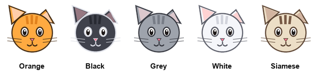

# 🐱 Cat Cursor

Turn your **entire Windows mouse cursor set** into cats — in five colours, with
animated loading pointers — or make a cursor out of **any picture you like**.

One click to apply, one click to undo. No installation, no admin rights, and it
only changes **your own** Windows user account.



---

## ⬇️ Quick start (for everyone)

1. Download **[`CatCursor.exe`](CatCursor.exe)** (click the file above, then the
   download button).
2. Double-click it.
3. Pick a **cat colour**, then click **“Turn my cursors into cats.”**
4. To go back, click **“Restore normal cursors.”**

That's it — the change is instant, no restart needed.

> **“Windows protected your PC”?**
> Because the app isn't code-signed, Windows SmartScreen may warn you the first
> time. It's safe — click **More info → Run anyway**. (Removing that prompt
> entirely requires a paid code-signing certificate.)

---

## ✨ Features

- **Whole cursor set themed** — every Windows pointer becomes a matching cat:

  | Pointer | Cat |
  |---|---|
  | Normal pointer | cat face |
  | Hovering a link | cat paw |
  | Text cursor | I-beam with cat ears |
  | Busy / loading | 💤 **animated** sleeping cat |
  | Working in background | **animated** spinner cat |
  | Help | cat + “?” |
  | Unavailable | cat in a red no-entry sign |
  | Resize ↕ ↔ ⤡ ⤢ | cat between resize arrows |
  | Move | cat with four-way arrows |
  | Precision crosshair | crosshair + small cat |
  | Handwriting pen | pencil with a pink cat eraser |
  | Alternate select | up arrow with a cat |

- **5 colours** — Orange, Black, Grey, White, Siamese.
- **Animated cursors** — the busy and loading pointers really move (`.ani`).
- **Bring your own picture** — turn any PNG/JPG into a cursor (see below).
- **Single self-contained `.exe`** — all images are embedded; nothing to install.
- **Fully reversible & per-user** — never touches other accounts or system files.

---

## 🖼️ Make a cursor from your own picture

In the app, under **“Make your own cursor from a picture”:**

1. Click **Choose picture…** and pick any image (PNG, JPG, BMP, GIF).
2. Choose **which pointer** it replaces — or **“Every pointer”** for all of them.
3. Choose the **click point** (Top-left behaves like a normal arrow).
4. Click **Use this picture as my cursor.**

> 💡 A **PNG with a transparent background** looks best. The app auto-scales your
> image to every cursor size and keeps transparency.

---

## 🧰 PowerShell (optional, for power users)

No `.exe` needed — these scripts work straight from the source folder:

```powershell
# Apply a colour theme (Orange, Black, Grey, White, Siamese)
.\Apply-CatCursor.ps1 -Color Black

# Restore the default Windows cursors
.\Revert-CatCursor.ps1

# Turn any picture into a cursor
.\Set-CustomCursor.ps1 -Image ".\mycat.png"
.\Set-CustomCursor.ps1 -Image ".\dog.png"   -Role Hand -Hotspot TopCenter
.\Set-CustomCursor.ps1 -Image ".\smiley.png" -Role All  -Hotspot Center
```

If a script is blocked, run it with `powershell -ExecutionPolicy Bypass -File <script>`.

---

## 🔧 Build from source

Requirements: **Python 3** with **Pillow** (`pip install Pillow`) to draw the
cursors, and the **.NET Framework** C# compiler (`csc.exe`, already on every
Windows PC) to build the exe.

```powershell
# 1. Generate all cursors (build\<Colour>\*.cur and *.ani)
python make_cat_cursor.py

# 2. Build the self-contained CatCursor.exe
powershell -ExecutionPolicy Bypass -File build_exe.ps1
```

| File | What it is |
|---|---|
| `make_cat_cursor.py` | Draws every cursor (all colours + animations) with Pillow |
| `CatCursor.template.cs` | The GUI app source (image→cursor converter + UI) |
| `build_exe.ps1` | Packs the cursors into a zip resource and compiles the exe |
| `CursorMaker.cs` | Shared image→`.cur` converter used by `Set-CustomCursor.ps1` |
| `Apply-CatCursor.ps1` / `Revert-CatCursor.ps1` | Apply / undo a theme |
| `Set-CustomCursor.ps1` | Turn a picture into a cursor from the command line |
| `build/<Colour>/` | The generated cursor files |

---

## ❓ How it works

Windows lets each user set custom pointers under the registry key
`HKCU\Control Panel\Cursors`. The app writes the cat cursor files to your
`%LOCALAPPDATA%\CatCursor` folder, points the registry values at them, and calls
`SystemParametersInfo(SPI_SETCURSORS)` so the change takes effect immediately.

Because everything lives under `HKEY_CURRENT_USER`, it only affects your account
and never modifies protected system files. **Restore** simply clears those
values so Windows falls back to its defaults.

## 🗑️ Uninstall

Click **Restore normal cursors** in the app (or run `Revert-CatCursor.ps1`),
then delete the `CatCursor.exe` and the `%LOCALAPPDATA%\CatCursor` folder.

## 📄 License

[MIT](LICENSE) — do whatever you like. 🐾
