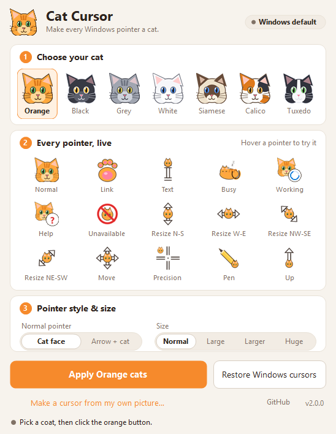
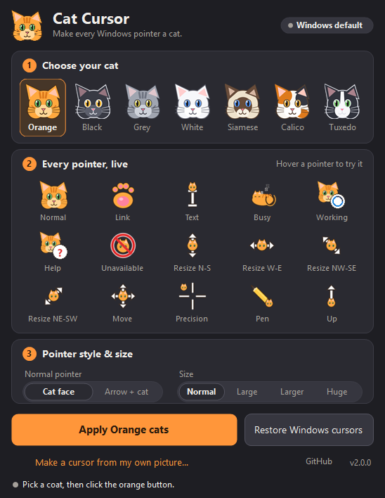
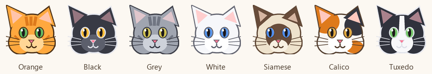
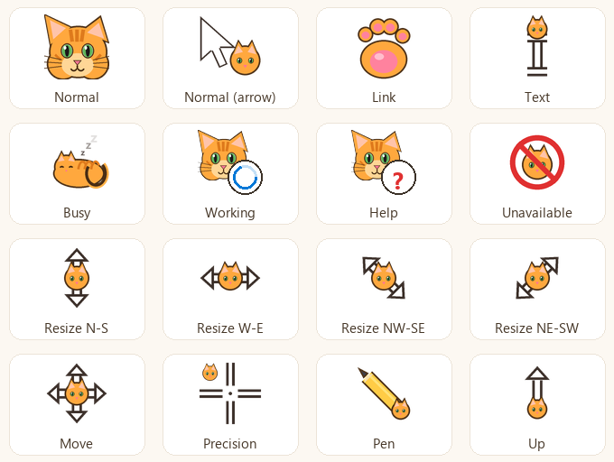
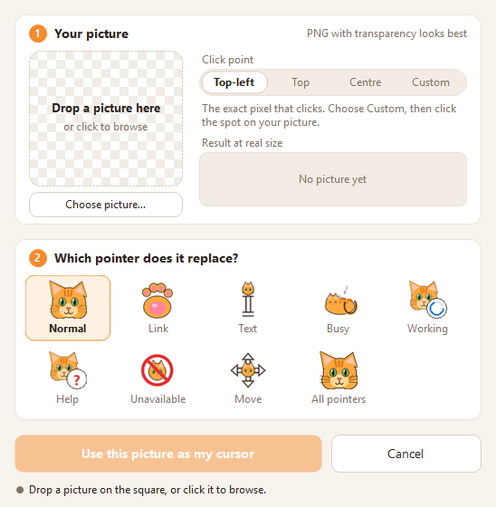

# 🐱 Cat Cursor

[](https://github.com/enriquevelmai/windows-cat-cursor/releases/latest)
[](#)
[](LICENSE)
[](#%EF%B8%8F-quick-start-for-everyone)

Turn your **entire Windows mouse cursor set** into cats — seven coats, two
pointer styles, animated loading pointers — or make a cursor out of **any
picture you like**.

One click to apply, one click to undo. No installation, no admin rights, and it
only changes **your own** Windows user account.

<p align="center">
  
  &nbsp;&nbsp;
  
</p>



> The full themed pointer set (Orange shown):



---

## ⬇️ Quick start (for everyone)

1. Download **`CatCursor.exe`** from the
   [**latest release**](https://github.com/enriquevelmai/windows-cat-cursor/releases/latest)
   (or grab [`CatCursor.exe`](CatCursor.exe) from the file list above).
2. Double-click it.
3. Pick a **cat**, hover the pointers to try them, then click **“Apply … cats.”**
4. To go back, click **“Restore Windows cursors.”**

That's it — the change is instant, no restart needed.

> **“Windows protected your PC”?**
> Because the app isn't code-signed, Windows SmartScreen may warn you the first
> time. It's safe — click **More info → Run anyway**. (Removing that prompt
> entirely requires a paid code-signing certificate.)

---

## ✨ Features

- **Whole cursor set themed** — every Windows pointer becomes a matching cat:

  | Pointer | Cat |
  |---|---|
  | Normal pointer | cat face (its sharp ear is the tip) **or** a classic arrow with a small cat |
  | Hovering a link | cat paw |
  | Text cursor | I-beam with cat ears |
  | Busy / loading | 💤 **animated** sleeping cat |
  | Working in background | **animated** spinner cat |
  | Help | cat + “?” |
  | Unavailable | cat in a red no-entry sign |
  | Resize ↕ ↔ ⤡ ⤢ | cat between resize arrows |
  | Move | cat with four-way arrows |
  | Precision crosshair | crosshair + small cat |
  | Handwriting pen | pencil with a cat on the eraser |
  | Alternate select | up arrow with a cat |

- **7 coats** — Orange tabby, Black, Grey tabby, White, Siamese, Calico, Tuxedo.
  Each has its own eye colour and markings.
- **2 pointer styles** — the cat face, or a Windows-style arrow with a cat
  perched on it if you prefer a conventional tip.
- **Live preview** — every pointer of the chosen coat is shown in the app,
  animations included. **Hover one to try it** as your real cursor before
  applying anything.
- **Pointer size** — Normal, Large, Larger or Huge, straight from the app (the
  same setting as Windows Settings › Accessibility › Mouse pointer).
- **Animated cursors** — the busy and loading pointers really move (`.ani`),
  with 32/48/64 px frames so they stay crisp when enlarged.
- **Bring your own picture** — drag & drop any PNG/JPG, click the exact pixel
  that should click, and see the result at real size (see below).
- **Light & dark** — the app follows your Windows app theme.
- **Single self-contained `.exe`** — all images are embedded; nothing to install.
- **Fully reversible & per-user** — never touches other accounts or system files.
- **Keyboard friendly** — everything is reachable with Tab and the arrow keys.

---

## 🖼️ Make a cursor from your own picture

<p align="center"></p>

In the app, click **“Make a cursor from my own picture…”**:

1. **Drop a picture** on the square (or click it to browse). PNG, JPG, BMP, GIF
   and ICO all work.
2. Choose the **click point**: Top-left behaves like a normal arrow, or pick
   **Custom** and click the exact spot on your picture. The red dot in the
   real-size preview shows where it will click.
3. Choose **which pointer** it replaces — or **All pointers**.
4. Click **Use this picture as my cursor.**

> 💡 A **PNG with a transparent background** looks best. The app auto-scales your
> image to every cursor size (32–128 px) and keeps transparency.

---

## 🧰 PowerShell (optional, for power users)

No `.exe` needed — these scripts work straight from the source folder:

```powershell
# Apply a coat (Orange, Black, Grey, White, Siamese, Calico, Tuxedo)
.\Apply-CatCursor.ps1 -Color Black

# Prefer a classic arrow with a small cat as the normal pointer
.\Apply-CatCursor.ps1 -Color Calico -Style Arrow

# Restore the default Windows cursors
.\Revert-CatCursor.ps1

# Turn any picture into a cursor
.\Set-CustomCursor.ps1 -Image ".\mycat.png"
.\Set-CustomCursor.ps1 -Image ".\dog.png"   -Role Hand -Hotspot TopCenter
.\Set-CustomCursor.ps1 -Image ".\wand.png"  -Hotspot Custom -HotspotX 0.1 -HotspotY 0.9
.\Set-CustomCursor.ps1 -Image ".\smiley.png" -Role All  -Hotspot Center
```

If a script is blocked, run it with `powershell -ExecutionPolicy Bypass -File <script>`.

---

## 🔧 Build from source

Requirements: **Python 3** with **Pillow** (`pip install Pillow`) to draw the
cursors, and the **.NET Framework** C# compiler (`csc.exe`, already on every
Windows PC) to build the exe.

```powershell
# 1. Generate all cursors (build\<Coat>\*.cur and *.ani), the icon and the README images
python make_cat_cursor.py

# 2. Build the self-contained CatCursor.exe
powershell -ExecutionPolicy Bypass -File build_exe.ps1

# (optional) Render the window to a PNG, e.g. for documentation
.\CatCursor.exe --light --screenshot docs\app-light.png
.\CatCursor.exe --dark  --screenshot docs\app-dark.png
.\CatCursor.exe --light --custom --screenshot docs\app-custom.png
```

| File | What it is |
|---|---|
| `make_cat_cursor.py` | Draws every cursor (all coats + animations), the app icon and previews, with Pillow |
| `CatCursor.template.cs` | The GUI app: embedded-pack loader, `.cur`/`.ani` decoder for the live preview, registry engine, custom controls (light/dark), picture dialog |
| `app.manifest` | DPI-awareness, visual styles and `asInvoker` manifest embedded in the exe |
| `build_exe.ps1` | Packs the cursors into a zip resource and compiles the exe (icon + manifest) |
| `CursorMaker.cs` | Shared image→`.cur` converter used by `Set-CustomCursor.ps1` |
| `Apply-CatCursor.ps1` / `Revert-CatCursor.ps1` | Apply / undo a theme |
| `Set-CustomCursor.ps1` | Turn a picture into a cursor from the command line |
| `build/<Coat>/` | The generated cursor files |
| `docs/` | Gallery, icon and app screenshots used by this README |

---

## ❓ How it works

Windows lets each user set custom pointers under the registry key
`HKCU\Control Panel\Cursors`. The app writes the cat cursor files to your
`%LOCALAPPDATA%\CatCursor` folder, points the registry values at them, and calls
`SystemParametersInfo(SPI_SETCURSORS)` so the change takes effect immediately.
The pointer-size option writes the same `CursorBaseSize` value that Windows
Settings uses.

Because everything lives under `HKEY_CURRENT_USER`, it only affects your account
and never modifies protected system files. **Restore** simply clears those
values so Windows falls back to its defaults.

## 🗑️ Uninstall

Click **Restore Windows cursors** in the app (or run `Revert-CatCursor.ps1`),
then delete `CatCursor.exe`, the `%LOCALAPPDATA%\CatCursor` folder and the
`HKCU\Software\CatCursor` key (it only remembers your pointer-style choice).

## 📄 License

[MIT](LICENSE) — do whatever you like. 🐾
